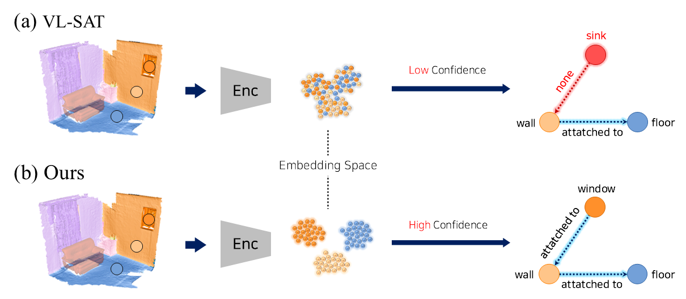
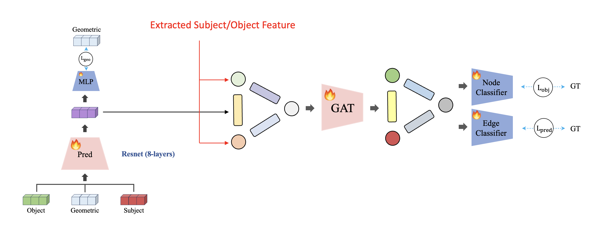
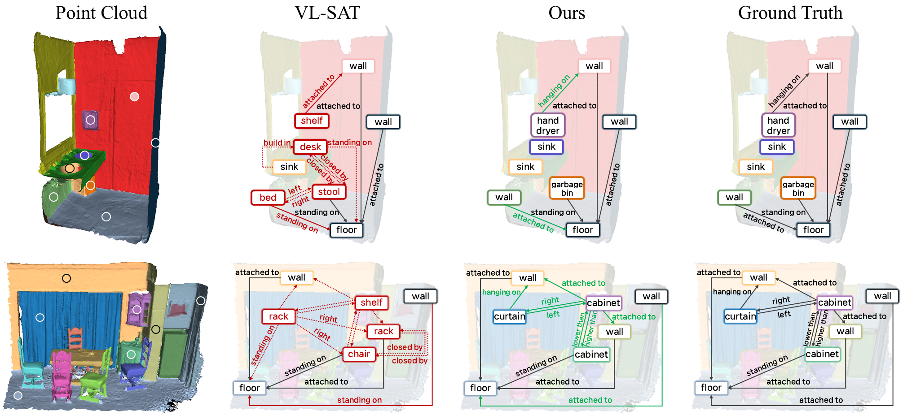

# Project Summary



Most 3D-SSG pipelines lean heavily on GNN reasoning while treating the object embeddings themselves as “good enough.”
Through a detailed error analysis you showed:

- Predicate mistakes explode whenever either subject or object is mis-classified.
- Predicate error rises almost monotonically with the entropy of the object classifier.

Key takeaway: sharpen the object feature space first; the entire graph benefits.

# Architecture Overview



| Stage                             | Core Idea                                                                            | Novel Components                                                                                                                 |
| --------------------------------- | ------------------------------------------------------------------------------------ | -------------------------------------------------------------------------------------------------------------------------------- |
| **Object Feature Learning (OFL)** | Contrastively pre-train an encoder on object point-clouds, RGB crops & text prompts. | *Decoupled supervised contrastive* loss (positive term removed) → stronger separation;<br>Affine-invariant T-Net regularisation. |
| **Relationship Feature Learning** | Fuse two object embeddings **plus** a compact geometric descriptor.                  | Local Spatial Enhancement (LSE) to keep geometry salient.                                                                        |
| **Graph Neural Network**          | Message-passing with spatial bias & edge asymmetry.                                  | Global Spatial Enhancement (GSE);<br>Bidirectional Edge Gating (BEG).                                                            |


# Environment Setup

```bash
conda create -n vlsat python=3.8
conda activate vlsat
pip install -r requirement.txt
pip install torch==1.12.1+cu113 torchvision==0.13.1+cu113 torchaudio==0.12.1 --extra-index-url https://download.pytorch.org/whl/cu113
pip install torch-scatter -f https://pytorch-geometric.com/whl/torch-1.12.1+cu113.html
pip install torch-sparse -f https://pytorch-geometric.com/whl/torch-1.12.1+cu113.html
pip install torch-spline-conv -f https://pytorch-geometric.com/whl/torch-1.12.1+cu113.html
pip install torch-geometric==2.2.0
pip install git+https://github.com/openai/CLIP.git
pip install hydra
pip install hydra-core --upgrade --pre
```

---

# Dataset Preparation

## 1. Download 3RScan  
First, download the 3RScan dataset. You can follow the instructions provided in the [3DSSG official guide](https://github.com/ShunChengWu/3DSSG#preparation).

## 2. Generate 2D Multi-view Images  
Convert the point clouds into 2D images from multiple viewpoints. Make sure to update the internal path in the script to match your local environment.

```bash
# Modify the path in pointcloud2image.py to match your local environment.
python data/pointcloud2image.py
```

## 3. Directory Structure  
Make sure your folders are organized as follows for proper operation:

```
data
  3DSSG_subset
    relations.txt
    classes.txt

  3RScan
    <scan_id_1>
      multi_view/
      labels.instances.align.annotated.v2.ply
    <scan_id_2>
    ...
```

---

# Training & Evaluation
Due to file size constraints (~100MB), the model checkpoint can't be included in this submission. It will be released with entire code through the GitHub repository upon acceptance.

```bash
# Train
python -m main --mode train --config <config_path> --exp <exp_name>

# Evaluate
python -m main --mode eval --config <config_path> --exp <exp_name>
```

---


# Demo



# Conclusion

By front-loading the pipeline with a truly discriminative, multimodal object encoder—and carefully propagating its semantics through spatially aware, direction-sensitive GNN layers—you set a new state of the art on nearly every 3DSSG benchmark metric, all while offering a drop-in upgrade path for existing models.


# References
This project is inspired by and partially based on the following repositories:

- [3DSSG](https://github.com/ShunChengWu/3DSSG)
- [VL-SAT (CVPR 2023)](https://github.com/wz7in/CVPR2023-VLSAT)
